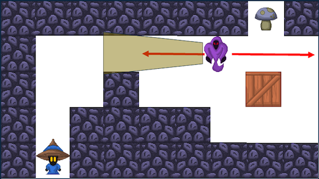
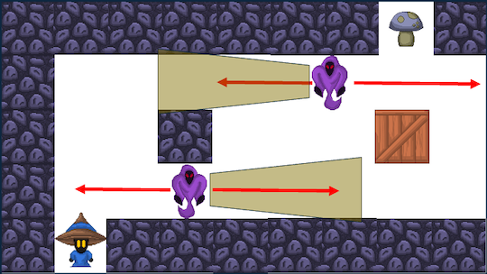

# Week 04 - Challenge Design
In today's class, you'll be moving beyond the lens of the toy and beginning to design some of the challenges for your final level.

## Tools used
Today's task uses (but is not limited to):
* GitHub Desktop (or your GitHub client of choice)
* Unity
* Prototyping tools of your choice.

## Assignment deliverable
Today, you should be working towards creating challenge prototypes for your level design task. Once again, you will be working in your assignment repo today, so make sure you are pushing things into that repo.

## Call to action (10 min)
Return to your toy from last week, including your notes. Consider which objects you most gravitated towards and found produced the most interesting dynamics. Then, consider how you could complete the sentence "I bet you can't..." with those objects in mind. Some generic examples:

* "I bet you can't get from this door to that door without one of the guards seeing you." (Stealth games)
* "I bet you can't survive for 5 minutes against the zombies." (Shooters, action games)
* "I bet you can't get to the top of the tower before the lava reaches you." (Platformers)

We are going to call this sentence your "call to action". Your call to action is going to inform how you develop your challenges today. From here, consider what kind of challenge this call to action infers: is it a physical challenge? An intellectual one? Maybe something else, or something in between?

Write down both your "I bet you can't..." statement and the type of challenge you are going for. This is now a core design goal for your level. It may change after today, but this is how we get started!

## Challenge 1: Core skill (20 min)
Create a new test scene in your repo (you can do this from the Kit Tools drop-down, or by duplicating an existing scene and then renaming and editing it. Make sure you name it properly!).

With reference to the lectures, think about what the <b>intrinsic skill</b> is here. What is it you are really testing the player on? Is it their ability to aim their weapon? Is it about pattern recognition of moving platforms? Prototype (pen and paper, then in engine) a small section of gameplay that tests only this intrinsic skill. For instance, if you are focused on precision of the player shooting a switch, then that aiming (and firing) is the intrinsic skill - don't introduce enemies or other objects that would require the player to focus on other skills at this stage.

We don't want to stifle your creativity too much here, so consider the example below for a made-up stealth game, where the player needs to sneak pass the ghoul (who patrols left and right with a cone of vision) and get to the mushroom:

The intrinsic skill here is about <b>timing movement</b> to avoid the enemy. Therefore, no additional stressors have been introduced yet. Consider how this line of thinking applies to your game.

Note: this mock-up was made in PowerPoint using some sprites and PowerPoint shapes. This is another approach to prototyping you might like to try. 

Don't make this challenge too difficult. However, the player should be able to "fail", either through death and restarting the level, or simply having to go back to the start and try again.

## Challenge 2: Something trickier... (15 min)
Create another section immediately after your first that engages with the same intrinsic skill but is more difficult for the player to achieve. As much as you can, avoid introducing other elements at this stage. 

Returning to the question of precision, what about a smaller switch? Or a narrower window to hit it in? What if the switch was further way? Think about how this makes things trickier for the player by challenging their aim (e.g., a switch further away changes how many positions you can hit it from). 

Continuing with the stealth game example, removing cover or introducing another enemy will increase the difficulty without engaging any other intrinsic skills.

Once again, prototype this section, and make sure you are capturing your artefacts as you go and placing them in your repo.

## Challenge 3: Stressors and tertiary challenges (15 min)
Create a third section following on from Challenge 2. Now that you understand the intrinsic skill you are engaging with and how to increase difficulty through it, we can consider what stressors may be added to introduce tertiary challenges and give more variance to the challenge. Going back over your notes from last week, think about some of the other objects you aren't currently using and the types of challenges they provide. Some example questions:

* How might environmental effects like moving platforms or hazards make this more challenging, dramatic or interesting for the player?
* Is there another category of challenge (physical, intellectual, etc...) that could compliment what is going on here? How so, and what objects could be used to achieve it?
* Is there something else you could be getting the player to do at the same time? Are there elements of the Ellen toy they aren't yet engaging with?

A couple of notes:
* Although in this context these are "stressors" and "tertiary challenges", that doesn't mean they don't have intrinsic skills associated with them as well. For instance, a party-based action RPG might have combat and social interact, which both require different intrinsic skills. Often, they're engaged with separately, but at times the player might need to use both skills at once. Indeed, this might be core to your player experience!
* Regardless, anything you add here still brings its own design considerations and will have meaningful impact on the player experience. Make sure you are complimenting the player experience, not creating discordance.

## "Well, can you?" - Time to play each other's games! (20 min)
As our other weeks, spend some time playing each other's games. Tell your call to action to your player and observe them play through your three challenges. Try to get a read for whether they are approaching flow: 
* Is the first challenge too hard and frustrating?
* Is the second too easy and boring?
* Does the third challenge ramp up the intensity and drama, or does it cause your player to disengage? Why?

## More challenges and dramatic arc (Until end)
At this stage you have:
* Identified the main type of challenge you want to engage with in your level.
* Identified at least one of the intrinsic skills the player will need to engage with when playing your level.
* Created three challenges that form a small dramatic arc with increases in difficult both via tests of the intrinsic skill and additional stressors.
* Have had someone else play the game and have an idea as to how your design is working.

Reflecting on all of this, start prototyping some more challenges that engage with the same skills as before. Consider what other objects can be used as stressors and how. 

Try prototyping a few challenges and assign each of them a score from 1 to 10 in terms of experiential intensity (as described in the lecture). How might you structure these challenges in sequence to have modulating intensity?

Allow these prototypes to be quick and dirty: sketches in your book, quick bashes in PowerPoint. This is about iteration and getting some ideas down. You'll have time for refinement outside of class!

## Next Week
Next week we'll be looking at how we can situate our challenges as parts of encounters and connect them together to form a cohesive player experience.